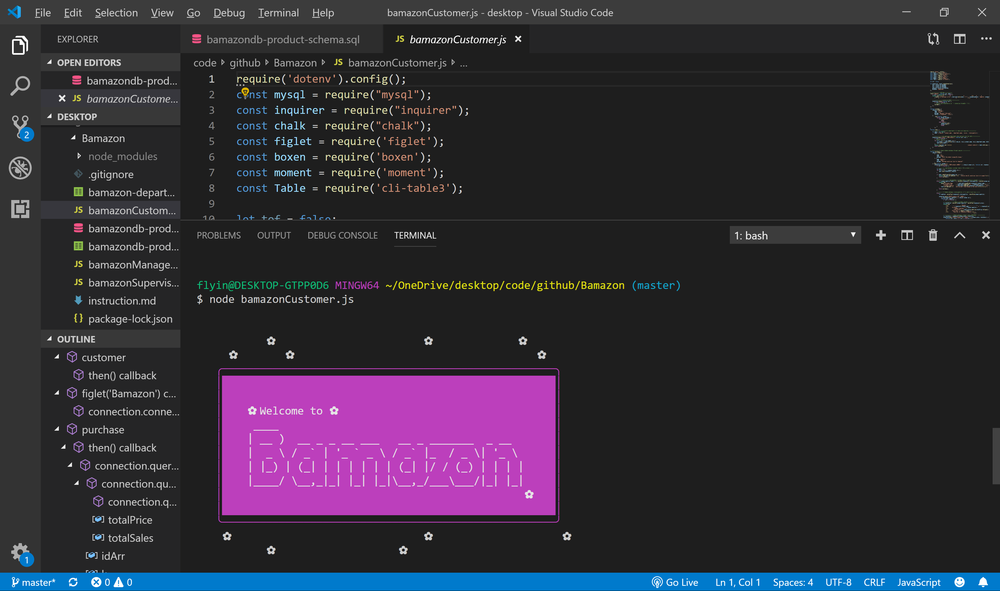

## Bamazon
### 📦 Bamazon
### Overview
Bamazon is an Amazon-like storefront with the MySQL database. The app will take in orders from customers and deplete stock from the store's inventory. You can program your app to track product sales across your store's departments and then provide a summary of the highest-grossing departments in the store. It is a command line app that takes in parameters and gives you back data. The app receive user input using the maysql, inquirer, chalk, figlet and boxen npm packages.

## 📓 Instruction
### Bamazon is composed with three apps.
* Bamazon customer app
* Bamazon manager app
* Bamazon supervisor app
### ✒️ 1. Customer App:
concert

A MySQL Database called bamazon.

* A Table inside of that database called products.

#### The products table have each of the following columns:

- [x]  item_id (unique id for each product)
- [x]  product_name (Name of product)
- [x]  department_name
- [x]  price (cost to customer)
- [x]  stock_quantity (how much of the product is available in stores)
##### A Node application called bamazonCustomer.js. Running this application will first display all of the items available for sale. Include the ids, names, and prices of products for sale.

#### The app will then prompt users with two messages.

* The first message ask customers the ID of the product they would like to buy.
* The second message ask how many units of the product they would like to buy. concert
* Once the customer has placed the order, Bamazon will check if the store has enough of the product to meet the customer's request.

* If not, the app will log a phrase like Insufficient quantity!, and then prevent the order from going through. concert
* If the store does have enough of the product, Bamazon will fulfill the customer's order.

#### This means updating the SQL database to reflect the remaining quantity.
##### Once the update goes through, show the customer the total cost of their purchase. concert
#### ✒️ 2. Manager App:
##### A Node application called bamazonManager.js. Running this application will:

* List a set of menu options:

- [x]  View Products for Sale
- [x]  View Low Inventory
- [x]  Add to Inventory
- [x]  Add New Product concert
* If a manager selects View Products for Sale, the app will list every available item: the item IDs, names, prices, and quantities. concert

* If a manager selects View Low Inventory, then it will list all items with an inventory count lower than five. concert

* If a manager selects Add to Inventory, it will display a prompt that will let the manager "add more" of any item in the store. concert

* If a manager selects Add New Product, it will allow the manager to add a completely new product to the store. concert

#### ✒️ 3. Supervisor App:
##### A MySQL table called departments includes the following columns:

- [x] department_id
- [x] department_name
- [x] over_head_costs (A dummy number you set for each department) concert
#### When a customer purchases anything from the store, the price of the product multiplied by the quantity purchased is added to the product's product_sales column.

##### Another Node app called bamazonSupervisor.js. Running this application will list a set of menu options:

* View Product Sales by Department
* Create New Department
#### When a supervisor selects View Product Sales by Department, the app will display a summarized table in their terminal/bash window.

department_id	department_name	over_head_costs	product_sales	total_profit
01	Electronics	10000	20000	10000
02	Clothing	60000	100000	40000
concert

The total_profit column is calculated on the fly using the difference between over_head_costs and product_sales. total_profit won't be stored in any database.
concert

concert

### Author

### Jerry Dai

Game Repo

#### Copyright
#### Jerry Dai © 2019 All Rights Reserved
